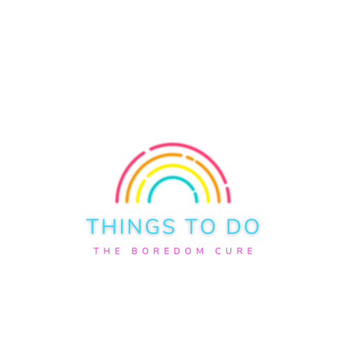
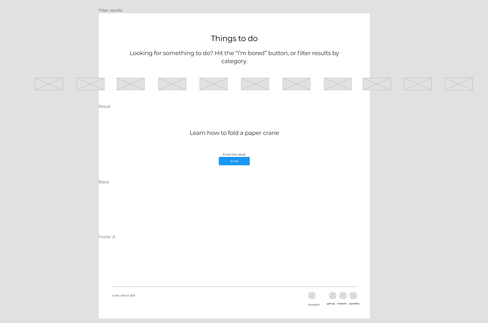
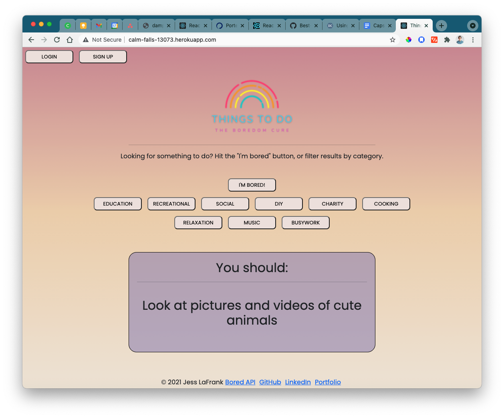
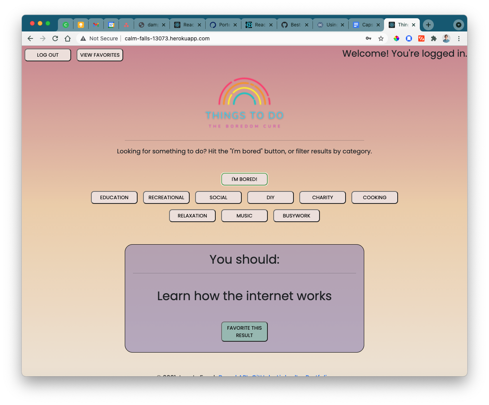
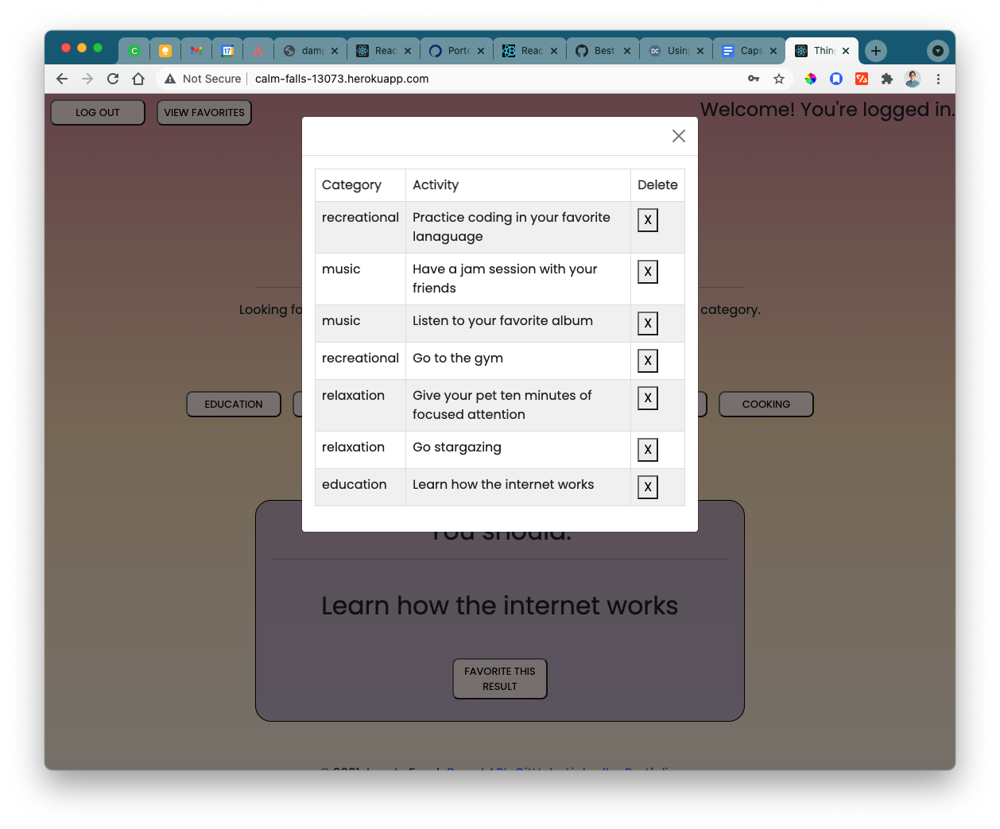

<!-- PROJECT LOGO -->
<br />
<div align="center" id="top">
    

  <h3 align="center">Things To Do: The Boredom Cure</h3>

</div>

<!-- ABOUT THE PROJECT -->

## About The Project

Things To Do is a full stack MERN application designed to help users come up with things to do when bored. The app generates random ideas, and allows users to save ideas to their favorites lists if logged in. The random ideas are fetched from [The Bored API](https://www.boredapi.com/). This project was developed as a capstone project for a General Assembly Software Engineering Immersive Bootcamp during Summer/Fall 2021.

## Overview & User Stories

- All users can generate random things to do when bored
- If a user logs in, they can favorite items to their favorites list
- Users can view their favorite items in one screen, and delete items from their list

### How it started:

Wireframe


### How it's going:

Landing Page when not logged in


<p align="right">(<a href="#top">back to top</a>)</p>

### Built With

This is a full-stack MERN application that utilizes the following technologies:

- [Mongo](https://www.mongodb.com/)
- [Mongoose](https://mongoosejs.com/docs/)
- [Express](https://expressjs.com/)
- [React.js](https://reactjs.org/)
- [Node](https://nodejs.org/en/)
- [React Bootstrap](https://react-bootstrap.github.io/)
- [Bootstrap](https://getbootstrap.com)
- [Dotenv](https://www.npmjs.com/package/dotenv)
- [jsonwebtoken](https://github.com/auth0/node-jsonwebtoken)
- [passport](https://www.passportjs.org/)
- [passport-jwt](http://www.passportjs.org/packages/passport-jwt/)
- [google-fonts](https://fonts.google.com/)
- [Heroku](https://www.heroku.com)

<p align="right">(<a href="#top">back to top</a>)</p>

<!-- GETTING STARTED -->

## Getting Started

To get started, create a master folder that will host two repos: one for front end, and one for back end. From the master folder, clone this repo down for your front end:

```sh
git clone git@github.com:jlafrank1/things-to-do-be.git
```

And this repo for your backend:

```sh
git clone git@github.com:jlafrank1/things-to-do-be.git
```

### Installation

For this project, you will need to install the following dependencies in your front end folder:

- Bootstrap
- dotenv
- react
- react-bootstrap
- react-dom

#### How to install these packages

In your terminal, run:

```
npm init
npm i bootstrap dotenv react react-bootstrap react-dom
```

Verify these have been installed by checking your package.json file.

And do the same for these dependencies in your backend folder:

- bcrypt
- body-parser
- cors
- dotenv
- ejs
- express
- jsonwebtoken
- method-override
- mongoose
- passport
- passport-jwt

<p align="right">(<a href="#top">back to top</a>)</p>

<!-- USAGE EXAMPLES -->

## Usage

When a user is logged in, they can access the button "Favorite This Result." This will save the currently displayed idea to the currently logged in user's Favorites list.


The following code allows fetched results to be displayed to all users, regardless if they are logged in, but only displays the "FavoriteResults" component if a user is logged in.

```
   return (
    <>
      <h2>{activity}</h2>

      <div id="email-results">
        {activity && currentUser ? (
          <FavoriteResults currentUser={currentUser} />
        ) : null}
      </div>
    </>
```

The user can view and delete items from their favorites list via a modal.


<p align="right">(<a href="#top">back to top</a>)</p>

<!-- ROADMAP -->

## Roadmap

- [] Optimize landing page and "Welcome" message for mobile
- [] Create a "loading" animation to show when fetch call is loading
- [] Improve UX feedback for when items are added to a Favorites list
- [] Incorporate Spotify API to "Play a Random Song"
- [] Allow users to Email results to a friend
- [] Allow users to mark items as "done" instead of just deleting them from the list

<p align="right">(<a href="#top">back to top</a>)</p>

<!-- CONTACT -->

## Contact

Please strike up a conversation with me, especially if you're interested in rollerskates!

- [LinkedIn](https://www.linkedin.com/in/jesslafrank/)
- [GitHub](https://github.com/jlafrank1)
- [Instagram](https://www.instagram.com/blood.sweat.and.ears/)

<p align="right">(<a href="#top">back to top</a>)</p>

<!-- ACKNOWLEDGMENTS -->

## Acknowledgments

This product is my capstone project for the **General Assembly Software Engineering Immersive program** completed in Fall 2021. I learned all languages, frameworks, and ecosystems (GitHub and Heroku) from the incredible instructional team of [Holly Girourd](https://github.com/hollygirouard), [Joshua Smith](https://github.com/maker-jws), and [Kenny Bushman](https://github.com/kbbushman).
I've collaborated with some amazing people in my cohort, and many people deserve thanks and shoutouts.

- [General Assembly](https://generalassemb.ly/)
- [The Bored API](https://www.boredapi.com/)
- [coolers.co](https://coolors.co/)

<p align="right">(<a href="#top">back to top</a>)</p>
